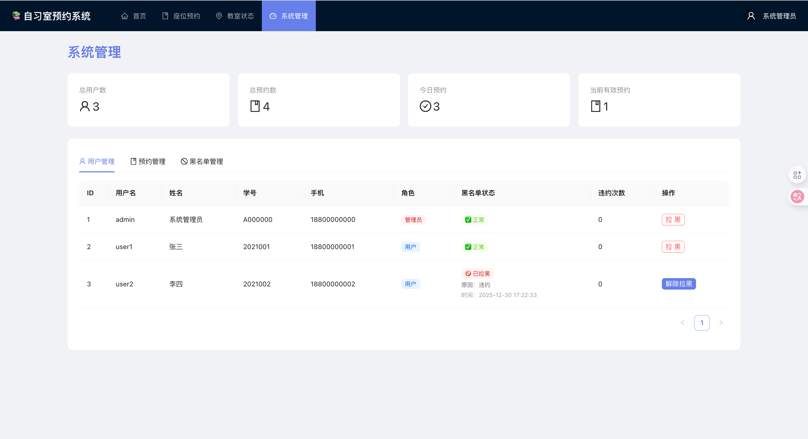

# 📋 GitHub 上传前检查清单

在上传到 GitHub 之前，请确保完成以下所有检查项：

## ✅ 代码检查

### 1. 敏感信息检查

- [ ] **删除所有密码**
  - 检查 `application.yml` 中是否有数据库密码
  - 检查代码中是否有硬编码的密钥
  
- [ ] **删除个人信息**
  - 姓名、邮箱、手机号等
  - 学号、身份证号等
  
- [ ] **删除临时文件**
  - 所有 `.log` 文件
  - 数据库文件（`backend/data/`）
  - 构建输出（`backend/target/`, `frontend/dist/`）

### 2. .gitignore 检查

- [ ] 项目根目录有 `.gitignore` ✅
- [ ] `.gitignore` 包含以下内容：
  - `*.log`
  - `backend/data/`
  - `backend/target/`
  - `frontend/dist/`
  - `frontend/node_modules/`
  - `.env` 和 `.env.local`
  - `.DS_Store` 和其他系统文件

### 3. 依赖检查

- [ ] 前端依赖正常
  ```bash
  cd frontend
  rm -rf node_modules package-lock.json
  npm install
  npm run build  # 确保无错误
  ```

- [ ] 后端依赖正常
  ```bash
  cd backend
  ./build.sh  # 确保无错误
  ```

## 📄 文档检查

- [ ] README.md 完整 ✅
- [ ] backend/README.md 完整 ✅
- [ ] frontend/README.md 完整 ✅
- [ ] LICENSE 文件存在 ✅
- [ ] DEPLOYMENT.md 存在 ✅

### README.md 必需内容

- [ ] 项目简介
- [ ] 功能特性
- [ ] 技术栈
- [ ] 快速开始指南
- [ ] 测试账号
- [ ] 项目结构
- [ ] API 文档链接

## 🔧 配置文件检查

- [ ] `.gitignore` ✅
- [ ] `LICENSE` ✅
- [ ] `backend/Dockerfile` ✅
- [ ] `backend/.dockerignore` ✅
- [ ] `frontend/vercel.json` ✅
- [ ] `frontend/.env.example` ✅

## 🚀 部署准备

- [ ] 前端环境变量配置
  - 创建 `frontend/.env.example`
  - 文档中说明如何配置 `VITE_API_BASE_URL`

- [ ] 后端 Dockerfile 准备好
- [ ] CORS 配置检查
  ```java
  // CorsConfig.java 中允许的域名
  .allowedOrigins(
      "http://localhost:5173",
      "https://your-app.vercel.app"  // 需要更新为实际域名
  )
  ```

- [ ] 数据库配置
  - H2 仅用于开发
  - 生产环境切换到 PostgreSQL

## 🧪 功能测试

- [ ] 本地启动后端成功
  ```bash
  cd backend
  ./run.sh
  # 访问 http://localhost:8080
  ```

- [ ] 本地启动前端成功
  ```bash
  cd frontend
  npm run dev
  # 访问 http://localhost:5173
  ```

- [ ] 测试主要功能
  - [ ] 用户注册/登录
  - [ ] 座位预约
  - [ ] 签到/取消
  - [ ] 管理员功能
  - [ ] 教室状态查看

## 📊 代码质量

- [ ] 前端无 TypeScript 错误
  ```bash
  cd frontend
  npm run build  # 应该无错误
  ```

- [ ] 后端无编译错误
  ```bash
  cd backend
  ./build.sh  # 应该 BUILD SUCCESS
  ```

- [ ] 删除调试代码
  - 删除 `console.log()`
  - 删除注释掉的代码
  - 删除 TODO 注释（或移到 Issue）

## 🏷️ Git 准备

- [ ] Git 仓库已初始化
  ```bash
  git init
  ```

- [ ] 添加所有文件
  ```bash
  git add .
  git status  # 检查是否有不该提交的文件
  ```

- [ ] 创建首次提交
  ```bash
  git commit -m "Initial commit: Study Room Booking System

  Features:
  - User authentication (login/register)
  - Seat booking with visual seat map
  - Check-in management with time windows
  - Classroom occupancy management
  - Admin dashboard
  - Blacklist management
  
  Tech Stack:
  - Backend: Spring Boot 3.2.1 + Java 17 + H2
  - Frontend: React 19 + TypeScript 5 + Vite 7 + Ant Design 6"
  ```

## 🌐 GitHub 仓库准备

### 1. 创建 GitHub 仓库

- [ ] 登录 GitHub
- [ ] 点击 "New repository"
- [ ] 仓库名称：`study-room-booking` 或自定义
- [ ] 描述：`🏫 Study Room Booking System - A web app for managing study room seat reservations`
- [ ] 设置为 Public（或 Private）
- [ ] **不要**勾选 "Initialize with README"（我们已有 README）
- [ ] **不要**添加 .gitignore（我们已有）
- [ ] **不要**选择 License（我们已有 MIT License）

### 2. 连接远程仓库

```bash
# 添加远程仓库
git remote add origin https://github.com/your-username/study-room-booking.git

# 或使用 SSH
git remote add origin git@github.com:your-username/study-room-booking.git

# 验证
git remote -v
```

### 3. 推送到 GitHub

```bash
# 重命名分支为 main（如果需要）
git branch -M main

# 首次推送
git push -u origin main
```

## 🎨 GitHub 仓库优化

### 添加 Topics

在 GitHub 仓库页面添加以下 topics：
- `spring-boot`
- `react`
- `typescript`
- `booking-system`
- `study-room`
- `seat-reservation`
- `java`
- `vite`
- `ant-design`

### 添加项目描述

```
🏫 Study Room Booking System - A web app for university study room seat management with visual seat selection, check-in system, and admin dashboard.
```

### 添加 About 链接

- Website: 部署后的前端 URL
- Topics: 添加相关标签

## 📸 添加预览图

- [ ] 截取应用界面截图
- [ ] 创建 `screenshots/` 目录
- [ ] 在 README.md 中添加截图：
  ```markdown
  ## 📸 预览

  
  
  
  ```

## 🔐 安全检查（最重要！）

### 绝对不能上传的内容

- [ ] ❌ 数据库密码
- [ ] ❌ API 密钥
- [ ] ❌ JWT 密钥
- [ ] ❌ 个人手机号/邮箱
- [ ] ❌ 学号/身份证号
- [ ] ❌ 生产环境配置文件

### 检查方法

```bash
# 搜索可能的敏感信息
grep -r "password" . --exclude-dir={node_modules,target,.git}
grep -r "secret" . --exclude-dir={node_modules,target,.git}
grep -r "@hfut.edu.cn" . --exclude-dir={node_modules,target,.git}
grep -r "13800138" . --exclude-dir={node_modules,target,.git}
```

## ✅ 最终检查

- [ ] 再次检查 .gitignore
- [ ] 再次检查是否有敏感信息
- [ ] README.md 中的链接都正确
- [ ] 测试账号信息是示例数据
- [ ] 代码可以在新机器上运行
- [ ] 文档清晰易懂

## 🎉 准备完毕！

当所有检查项都完成后，你可以安全地上传到 GitHub 了！

```bash
# 最后一次检查
git status

# 推送
git push -u origin main
```

## 📝 上传后的工作

- [ ] 检查 GitHub 仓库页面显示正常
- [ ] README.md 格式正确
- [ ] 添加 Star 到自己的仓库（可选）
- [ ] 创建 Release tag（可选）
  ```bash
  git tag -a v1.0.0 -m "Initial release"
  git push origin v1.0.0
  ```
- [ ] 部署到 Vercel/Railway（参考 DEPLOYMENT.md）

---

**祝上传顺利！** 🚀

遇到问题？检查 GitHub 的帮助文档或提问。
