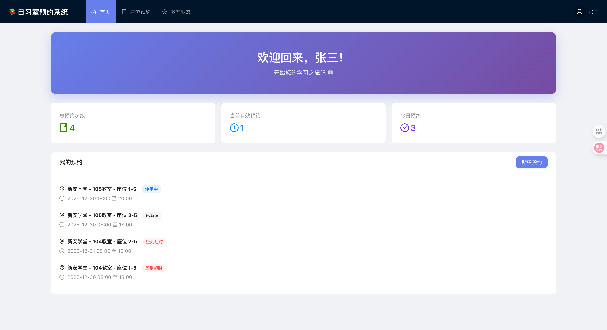

# 🏫 自习室座位预约系统

> 合肥工业大学宣城校区自习室座位智能预约管理系统

[](LICENSE)
[](https://www.oracle.com/java/)
[](https://spring.io/projects/spring-boot)
[](https://reactjs.org/)
[](https://www.typescriptlang.org/)

## 📸 系统预览

### 登录页面


### 用户首页



### 座位预约


### 系统管理后台


---

## ✨ 功能特性

### 🎯 核心功能

- 👤 **用户系统** - 注册/登录、个人信息管理
- 🏢 **教学楼管理** - 2 栋楼 × 5 层 × 30 教室 = 300 个教室
- 💺 **座位预约** - 可视化座位地图（10 行 ×10 列，共 100 座位/教室）
- ⏰ **智能时间选择** - 防止预约过去时间，半小时步长
- ✅ **签到管理** - 签到窗口、超时处理、自动违约
- 📊 **教室占用** - 实时查看教室被占用情况（课程、会议等）
- 🚫 **黑名单系统** - 违规用户管理
- 👨‍💼 **管理后台** - 用户、预约、黑名单统计管理

### 🔐 预约规则

- ✅ **每天一预约**：每个用户每天只能预约一次（确保公平）
- ✅ **跨日预约**：可以预约未来不同日期的座位
- ⏰ **签到窗口**：开始前 30 分钟至开始后 15 分钟
- ⚠️ **超时违约**：超过签到窗口未签到将标记为违约
- 🚫 **黑名单限制**：被拉黑用户无法预约

### 📱 用户体验

- 🎨 **现代化 UI** - 基于 Ant Design 6
- 🖼️ **可视化座位图** - 类似电影院选座体验
- 📅 **智能默认时间** - 自动设置为下一个整点
- 🔔 **实时状态提示** - 签到倒计时、超时提醒
- 📊 **数据统计** - 个人预约统计、违约记录

## 🚀 快速开始

### 环境要求

| 软件    | 版本             | 说明         |
| ------- | ---------------- | ------------ |
| Java    | 17+              | 后端运行环境 |
| Maven   | 3.9+             | 后端构建工具 |
| Node.js | 20.19+ or 22.12+ | 前端运行环境 |
| npm     | 9+               | 前端包管理器 |

> 💡 **支持平台**: macOS、Linux、Windows

### 1️⃣ 克隆项目

```bash
git clone <repository-url>
cd library
```

### 2️⃣ 启动后端

#### macOS / Linux

```bash
cd backend
chmod +x build.sh run.sh  # 首次运行需要添加执行权限
./build.sh                 # 编译项目
./run.sh                   # 启动服务
```

#### Windows

```cmd
cd backend
build.bat                  # 编译项目
run.bat                    # 启动服务
```

**后端服务地址**：http://localhost:8080

### 3️⃣ 启动前端

打开新终端窗口：

#### macOS / Linux

```bash
cd frontend
chmod +x start.sh          # 首次运行需要添加执行权限
./start.sh                 # 自动安装依赖并启动
```

#### Windows

```cmd
cd frontend
start.bat                  # 自动安装依赖并启动
```

**前端应用地址**：http://localhost:5173

### 4️⃣ 访问应用

- 🌐 **前端应用**：http://localhost:5173
- 🔧 **后端 API**：http://localhost:8080/api
- 🗄️ **H2 控制台**：http://localhost:8080/api/h2-console
  - JDBC URL: `jdbc:h2:file:./data/studyroom`
  - Username: `sa`
  - Password: (留空)

## 👥 测试账号

| 角色        | 用户名  | 密码          | 权限说明                       |
| ----------- | ------- | ------------- | ------------------------------ |
| 👨‍💼 管理员   | `admin` | `admin123`    | 系统管理、用户管理、黑名单管理 |
| 👤 普通用户 | `user1` | `password123` | 座位预约、签到签退             |
| 👤 普通用户 | `user2` | `password123` | 座位预约、签到签退             |

> 💡 提示：登录后可在前端界面注册新用户

## 📖 技术栈

### 后端技术

| 技术            | 版本    | 用途         |
| --------------- | ------- | ------------ |
| Spring Boot     | 3.2.1   | Web 框架     |
| Java            | 17      | 编程语言     |
| Spring Data JPA | 3.2.1   | ORM 框架     |
| H2 Database     | 2.2.224 | 嵌入式数据库 |
| Lombok          | 1.18.30 | 代码简化     |
| Maven           | 3.9+    | 构建工具     |

### 前端技术

| 技术         | 版本  | 用途        |
| ------------ | ----- | ----------- |
| React        | 19    | UI 框架     |
| TypeScript   | 5     | 编程语言    |
| Vite         | 7     | 构建工具    |
| Ant Design   | 6     | UI 组件库   |
| React Router | 7     | 路由管理    |
| Axios        | 1.6+  | HTTP 客户端 |
| Day.js       | 1.11+ | 日期处理    |

## 📁 项目结构

```
library/
├── README.md                    # 项目主文档
├── LICENSE                      # MIT 许可证
├── DEPLOYMENT.md                # 部署指南
├── GITHUB_CHECKLIST.md          # GitHub 上传检查清单
├── screenshots/                 # 系统截图
│   ├── login.png
│   ├── home.png
│   ├── booking.png
│   └── admin.png
├── backend/                     # 后端项目
│   ├── README.md                # 后端详细文档
│   ├── src/main/
│   │   ├── java/com/hfut/studyroom/
│   │   │   ├── entity/          # 实体类（User, Booking, Seat等）
│   │   │   ├── repository/      # 数据访问层（JPA Repository）
│   │   │   ├── service/         # 业务逻辑层
│   │   │   ├── controller/      # REST API控制器
│   │   │   ├── dto/             # 数据传输对象
│   │   │   ├── exception/       # 异常处理
│   │   │   ├── config/          # Spring配置（CORS, Security）
│   │   │   ├── scheduler/       # 定时任务（超时检测）
│   │   │   └── init/            # 数据初始化
│   │   └── resources/
│   │       └── application.yml  # 应用配置
│   ├── build.sh                 # 构建脚本 (macOS/Linux)
│   ├── build.bat                # 构建脚本 (Windows)
│   ├── run.sh                   # 运行脚本 (macOS/Linux)
│   ├── run.bat                  # 运行脚本 (Windows)
│   ├── Dockerfile               # Docker容器配置
│   └── pom.xml                  # Maven依赖配置
└── frontend/                    # 前端项目
    ├── README.md                # 前端详细文档
    ├── src/
    │   ├── pages/               # 页面组件
    │   │   ├── Login/           # 登录注册页
    │   │   ├── Home/            # 用户首页
    │   │   ├── Booking/         # 座位预约页
    │   │   ├── ClassroomStatus/ # 教室状态页
    │   │   └── Admin/           # 管理后台页
    │   ├── components/          # 通用组件（SeatMap, CheckInGuide）
    │   ├── layouts/             # 布局组件
    │   ├── services/            # API服务
    │   ├── types/               # TypeScript类型定义
    │   └── utils/               # 工具函数（auth, request）
    ├── start.sh                 # 启动脚本 (macOS/Linux)
    ├── start.bat                # 启动脚本 (Windows)
    ├── package.json             # npm依赖配置
    ├── vercel.json              # Vercel部署配置
    └── vite.config.ts           # Vite构建配置
```

## 🎯 核心功能说明

### 1. 座位预约流程

```
1. 选择教学楼和教室
   ↓
2. 选择日期和时间（智能时间选择）
   - 默认：下一个整点开始
   - 步长：30分钟
   - 限制：不能选择过去时间
   ↓
3. 查看可视化座位图（10×10）
   - 🟢 绿色：可用
   - ⚪ 灰色：已占用
   - 🔴 红色：教室整体占用
   ↓
4. 点击座位确认预约
   ↓
5. 预约成功（状态：待签到）
```

### 2. 签到规则

| 时间段                          | 状态        | 说明                      |
| ------------------------------- | ----------- | ------------------------- |
| 开始前 > 30 分钟                | ⏰ 太早     | 无法签到                  |
| 开始前 30 分钟 - 开始后 15 分钟 | ✅ 签到窗口 | 可以签到                  |
| 开始后 > 15 分钟                | ❌ 超时     | 自动标记为违约（TIMEOUT） |

**示例**：预约时间 10:00-12:00

- ✅ 09:30-10:15：可以签到
- ⚠️ 10:16 开始：签到超时，自动违约

### 3. 预约状态说明

| 状态        | 中文     | 颜色    | 说明               |
| ----------- | -------- | ------- | ------------------ |
| `PENDING`   | 待签到   | 🟡 黄色 | 预约成功，等待签到 |
| `ACTIVE`    | 使用中   | 🔵 蓝色 | 已签到，正在使用   |
| `COMPLETED` | 已完成   | 🟢 绿色 | 正常完成           |
| `CANCELLED` | 已取消   | ⚪ 灰色 | 用户主动取消       |
| `VIOLATED`  | 违约     | 🔴 红色 | 签到后未到场       |
| `TIMEOUT`   | 签到超时 | 🔴 红色 | 超时未签到         |

### 4. 教室占用管理

管理员可以标记教室被占用（如上课、会议），用户预约时自动过滤：

- 📚 **COURSE**：课程占用
- 🏢 **MEETING**：会议占用
- 🔧 **MAINTENANCE**：维护中
- 📋 **OTHER**：其他占用

## 📚 API 文档

### 认证相关

```http
POST   /api/auth/register          # 用户注册
POST   /api/auth/login             # 用户登录
```

### 教学楼和教室

```http
GET    /api/buildings              # 获取所有教学楼
GET    /api/classrooms             # 获取教室列表
GET    /api/classrooms/{id}        # 获取教室详情
GET    /api/classrooms/{id}/seats  # 获取教室座位（含状态）
```

### 预约管理

```http
POST   /api/bookings               # 创建预约
GET    /api/bookings/my            # 获取我的预约
POST   /api/bookings/{id}/checkin  # 签到
POST   /api/bookings/{id}/checkout # 签退
DELETE /api/bookings/{id}          # 取消预约
```

### 教室占用

```http
GET    /api/classroom-occupancy               # 获取所有占用记录
GET    /api/classroom-occupancy/classroom/{id} # 获取指定教室占用
POST   /api/classroom-occupancy               # 创建占用记录（管理员）
PUT    /api/classroom-occupancy/{id}          # 更新占用记录（管理员）
DELETE /api/classroom-occupancy/{id}          # 删除占用记录（管理员）
```

### 管理员接口

```http
GET    /api/admin/users            # 获取所有用户
GET    /api/admin/bookings         # 获取所有预约
GET    /api/admin/blacklist        # 获取黑名单
POST   /api/admin/blacklist        # 添加黑名单
DELETE /api/admin/blacklist/{id}   # 移除黑名单
GET    /api/admin/statistics       # 获取统计数据
```

详细 API 文档请参考：

- [后端 API 文档](backend/README.md#api-接口文档)
- [前端服务文档](frontend/README.md#api-服务)

## 🗄️ 数据库设计

系统使用 H2 嵌入式数据库，包含 7 张核心表：

| 表名                  | 说明       | 主要字段                                                  |
| --------------------- | ---------- | --------------------------------------------------------- |
| `app_user`            | 用户表     | id, username, password, realName, role, status            |
| `building`            | 教学楼表   | id, name, location, floors, openTime, closeTime           |
| `classroom`           | 教室表     | id, building_id, roomNumber, floor, capacity              |
| `seat`                | 座位表     | id, classroom_id, seatNumber, rowNum, colNum              |
| `booking`             | 预约表     | id, user_id, seat_id, startTime, endTime, status          |
| `blacklist`           | 黑名单表   | id, user_id, reason, created_by, created_at               |
| `classroom_occupancy` | 教室占用表 | id, classroom_id, occupancyDate, startTime, endTime, type |

**数据文件位置**：`backend/data/studyroom.mv.db`

## 🔧 开发指南

### 后端开发

#### 修改代码后重新部署

```bash
cd backend
./build.sh   # 重新编译
./run.sh     # 重新启动
```

#### 重置数据库

```bash
cd backend
rm -rf data/
./run.sh     # 重启会自动初始化示例数据
```

#### 修改配置

编辑 `backend/src/main/resources/application.yml`：

```yaml
server:
  port: 8080 # 修改端口
spring:
  h2:
    console:
      enabled: true # H2控制台开关
  datasource:
    url: jdbc:h2:file:./data/studyroom # 数据库路径
```

### 前端开发

#### 热重载开发

```bash
cd frontend
npm run dev   # 修改代码后自动刷新
```

#### 构建生产版本

```bash
cd frontend
npm run build      # 构建到 dist/
npm run preview    # 预览生产构建
```

#### 修改配置

编辑 `frontend/src/utils/request.ts`：

```typescript
const baseURL = 'http://localhost:8080/api' // 后端API地址
```

## ⚠️ 注意事项

### 环境要求

- ✅ 后端必须使用 **Java 17**（不支持 Java 8/11）
- ✅ 前端推荐使用 **Node.js 20.19+** 或 **22.12+**
- ✅ 确保 **8080** 和 **5173** 端口未被占用

### 启动顺序

1. **先启动后端**，等待完全启动（显示 "Started StudyRoomApplication"）
2. **再启动前端**，等待编译完成（显示 "ready in XXms"）
3. **打开浏览器**访问 http://localhost:5173

### 数据持久化

- H2 数据库数据保存在 `backend/data/` 目录
- 删除该目录将清空所有数据
- 重启后自动创建示例数据

### 生产环境部署

- ⚠️ H2 数据库**仅用于开发测试**
- 生产环境请使用 MySQL/PostgreSQL
- 修改 `application.yml` 中的数据源配置
- 前端需构建后部署到 Nginx/Apache

## 🐛 常见问题

### Q1：后端启动失败 "JAVA_HOME not found"

**A**：确保已安装 Java 17 并设置环境变量：

```bash
export JAVA_HOME=/path/to/jdk-17
export PATH=$JAVA_HOME/bin:$PATH
```

### Q2：前端启动报错 "Node.js version too old"

**A**：升级 Node.js 到 20.19+ 或 22.12+：

```bash
# 使用 nvm
nvm install 22
nvm use 22
```

### Q3：无法预约座位，提示"每天只能预约一次"

**A**：系统限制每个用户每天只能预约一次，可以：

- 取消当天的预约后重新预约
- 预约未来其他日期的座位

### Q4：签到按钮灰色不可用

**A**：检查是否在签到窗口内：

- 预约开始前 30 分钟 ～ 预约开始后 15 分钟
- 超过此时间将自动标记为超时

### Q5：教室占用后用户能看到吗？

**A**：用户在选择座位时，如果教室被占用（课程、会议等），该教室的所有座位将显示为"已占用"状态。

## 📝 更新日志

### v1.0.0 (2025-12-30)

- ✅ 完成用户系统（注册、登录、权限）
- ✅ 完成座位预约系统（可视化选座）
- ✅ 完成签到管理（签到窗口、超时处理）
- ✅ 完成管理后台（用户、预约、黑名单管理）
- ✅ 完成教室占用管理功能
- ✅ 优化时间选择器（智能默认、半小时步长）
- ✅ 完善文档和部署脚本

## 📄 许可证

本项目仅用于学习交流，未经许可不得用于商业用途。

## 🤝 贡献指南

欢迎提交 Issue 和 Pull Request！

1. Fork 本项目
2. 创建特性分支 (`git checkout -b feature/AmazingFeature`)
3. 提交更改 (`git commit -m 'Add some AmazingFeature'`)
4. 推送到分支 (`git push origin feature/AmazingFeature`)
5. 开启 Pull Request

## 📧 联系方式

- **学校**：合肥工业大学宣城校区
- **年份**：2025

---

**Made with ❤️ for HFUT Students**
